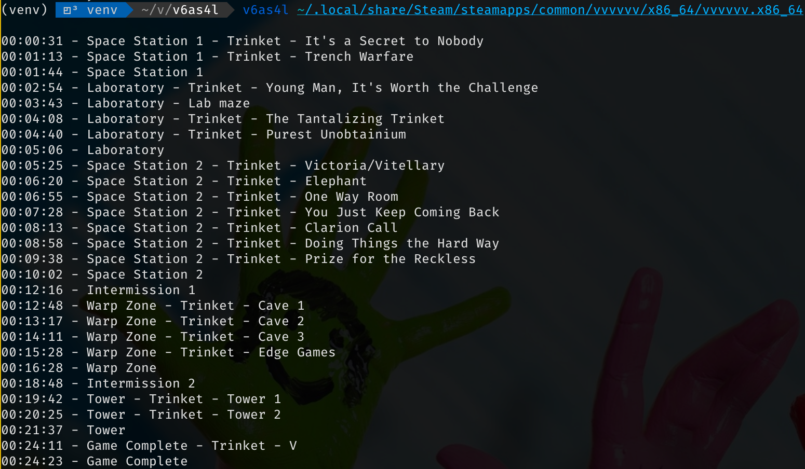

VVVVVV auto splitter for Linux (V6as4L)
=======================================

This is a first attempt at an auto splitter for the game VVVVVV specifically for Linux. Right now, all output is on the console. And a lot of quality of life features are missing, like compare to earlier splits or even saving splits. But this uses the correct ingame time.

## Installation

The program can be installed via pip

```
pip install --user git+https://github.com/christofsteel/v6as4l.git
```

## Usage

Once installed you can run it with `v6as4l path/to/vvvvvv.x86_64`. In my case that would be

```
v6as4l ~/.local/share/Steam/steamapps/common/vvvvvv/x86_64/vvvvvv.x86_64
```

## Todos:

 - [X] Read all the relevant information from the game's memory
 - [X] Trigger splits for my Glitchless 100% route
 - [X] Have a rudimentary output of the splits
 - [X] Support for subsplits (and subsubsplits, and subsubsubssplits and so on)
 - [ ] Actually save and compare times
 - [ ] Have a nice GUI
 - [ ] Support other routes
 - [ ] Support other games

## Screenshot



## How does it work?

To implement an auto splitter for VVVVVV on Linux we are facing basically two problems: VVVVVV and Linux. On Linux it is generally not possible to access the memory of a process in another process, unless that process runs with root privileges, or is the parent of the other process. Since it is a bad idea to run a "some guys speedrunning program" with root privileges, we opt for the second option. This means that the auto splitter needs to launch the game executable. Reading and writeing to memory is done using the `ptrace` syscall.

The other problem is VVVVVV itself. In version 2.2 the game object, that holds the global state of the game, is created in the stack in the `main` function of the game (This is no longer the case in the currently unreleased version 2.3 of the game). This has the unfortunate side effect that we cannot deterministic infer the location of the object in memory. To address this problem, we utilize a method, that is usually used in debugging tools, like `gdm` or `lldb`; we insert a breakpoint in the game.

When a progam is run on linux (and to my knowlege in any operating system), its code is copied into the system's memory. Once there, a process with enough privileges -- like a root process or a parent process -- can attatch itself to it (usually as some sort of debugger) and read and write to it the processes memory and code. To insert a breakpoint into a program, we overwrite the instruction at the address we want to break with the instruction `int3` (Or `0xcc` in x86 machine code). Once the program executes this, the cpu issues a trap and control goes to the debugging process. In our case the debugging process would be `v6as4l`. We set a breakpoint at the address `0x416da8`, which corresponds to line 99 in `main.cpp` in the games source code.

This is the location in code, where the game object is created: `main.cpp:99| Game game;`. When we look at the corresponding assembler code at that address, it reads `lea 0xe20(%rsp),%rdi`. Without going into to much detail, it says that the game object starts with an offset of `0xe20` to the current stack pointer (`rsp`).

Since we know that this offset is static, we only need to get the stack pointer at the time, and calculate the address in memory. Luckily we set a breakpoint at that exact location, so when the game reaches that point, control goes to our auto splitter and we can just read the current stack pointer (The stack pointer for the game, not for the auto splitter). Now we have access to the game object. All attributes of the game object, like the current gamestate, the amount of trinkets, the current time, all have a static offset to the beginning of the game object, so we can calculate their addresses and read them as well. To resume execution of the game, we need to write the instruction back, that was at address `0x416da8` previously, decrease the instruction pointer by one (so that it executes address `0x416da8` a second time, but this time not `int3`, but `lea 0xe20(%rsp),%rdi`) and hand back control to the game.

Now all that is left to do, is periodically read the data at the memory locations and infer whether a trinket has been found or a level has been completed.
